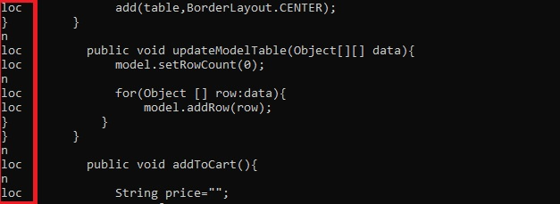

# LOC
Simpliest jar ever made, it just count how many lines of your project are actual lines of code.
It also distinguish between comment lines, close lines '}' and blank lines.

to run it, put the LOC.jar file among a folder called "new", in which, the .java files to check
should be placed in. Once you run it, an "output.txt" will be generated with all the info.

Have fun!

PD: if you want to see same feedback run it writting something like "java -jar "LOC.jar"", if not
just double-click that jar file

